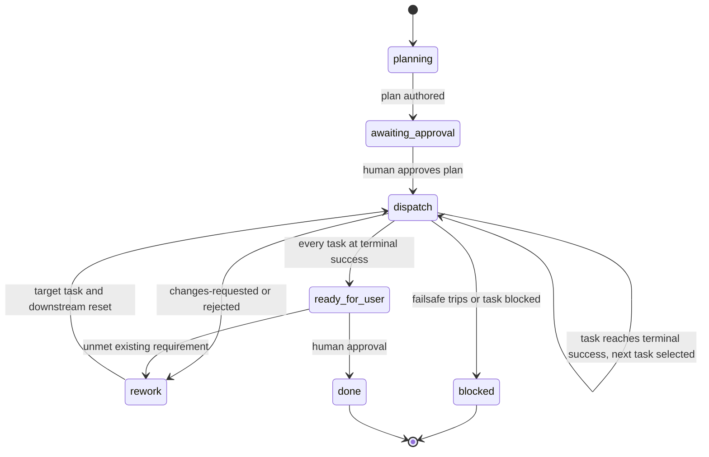

# ADLC Workflow

The `adlc` workflow is the orchestration contract for the Agentic Development Lifecycle. It defines how a work item moves from intake to a delivered, validated change.

This document is **descriptive**. The authority for routing is code:

- `.agents/tools/work_items/phases.py` owns phase ownership, per-phase state machines, and outcome transitions.
- `.agents/tools/adlc/routing.py` owns task selection.
- `.agents/tools/adlc/policy.py` owns the failsafes.

If this document and that code disagree, the code wins and this document is a bug.

## Core principle

Each agent session is a pure function:

> read the task -> perform exactly one step -> record the outcome -> stop.

The **orchestrator** asks `python .agents/run.py adlc next {work-item-id}` what happens next and dispatches it. It does not reason about routing. Implementing agents perform work and record an outcome. They do not route and they do not change work-item status.

This separation is what makes loop termination guaranteed rather than hoped for: an agent cannot reset its own attempt counter or route itself past a guard.

### Ownership rules

- Only the orchestrator changes a work item's lifecycle status. Use `python .agents/run.py work_items change-status`.
- Task state, attempts, remediation, and metrics are all mutated through `python .agents/run.py work_items record_activity`. Nothing else writes them.
- Triage and the software architect record their run metrics through `python .agents/run.py work_items record_intake`, which writes the `intake` history and `execution.totals` only.
- Implementing agents record an outcome for their own task only. The service rejects an activity whose `agent` is not the task owner.
- There is no control file. The work item is the single source of truth.

## Intake and planning

1. `triage` creates one or more work items with status `new`, then records its run metrics against each of them with `record_intake`.
2. `software-architect` authors the task plan for **every** work-item type:
   - `user-story` and `chore`: a specification plus tasks, via `add_spec`.
   - `bug` and `documentation`: tasks only, via `add_tasks`. These types have no specification.
3. A human approves the plan via `approve_plan`. This is the only planning gate and it applies to all types.
4. `software-architect` records its design run metrics with `record_intake`.

No task can be dispatched or record activity until `planStatus` is `approved`.

## Task graph shape

The architect authors a graph of single-owner phase tasks. Dependencies express order.

| Work item type | Typical graph |
| --- | --- |
| `user-story`, `chore` | per unit: `implementation` -> `unit-test` -> `review`; then optional `integration-test`; then `validation` |
| `bug` | `bug-repro` -> `implementation` -> `unit-test` -> `validation` |
| `documentation` | `documentation` -> `validation` |

Rules enforced by the service:

- Every plan contains a `validation` task.
- `user-story` and `chore` plans must cover every `implementation` task with a downstream `review` task. Review is mandatory for these types only.
- `bug` and `documentation` plans must not contain `review` tasks.
- `integration-test` appears only when the architect plans it. Nothing synthesises one.

Phases, owners, and per-phase states are defined in [.agents/resources/tasks.md](../resources/tasks.md).

## Execution loop



One cycle:

1. `python .agents/run.py adlc next {work-item-id}` returns one of `await-approval`, `dispatch`, `block`, `ready-for-user`, or `stop`.
2. On `dispatch`, the orchestrator invokes the named `owner` as a subagent in a fresh session with the returned work item id, task id, phase, technology, iteration, plan policy, and task-specific repository-context brief. The brief is a sourced convenience; the approved work item and specification remain authoritative.
3. The agent does the work and calls `record_activity` with its outcome and metrics.
4. The orchestrator waits for the subagent, verifies its recorded activity, runs the ownership guard, and commits the accepted run.
5. The orchestrator's next tool call is `python .agents/run.py adlc next {work-item-id}`. It does not defer that call to a todo or return control to the user between cycles.

Task selection is simply: the first task in plan order whose dependencies are all at terminal success and whose own state is not terminal. Nothing more clever is needed, which is the point.

## Remediation

`review` returns `approved` or `changes-requested`. `validation` returns `validated` or `rejected`. Both failure outcomes require `remediationTargetTaskId`.

The service then returns the named task to `rework-required` or `tests-failing`, resets every task downstream of it to `not-started`, and increments `reviewLoops` or `validationLoops`. Retries append history to the existing task; they never create new tasks.

A validator that finds the **requirement itself** is wrong must return `blocked`, not `rejected`. A wrong requirement cannot be fixed by an engineer, and looping on it burns the whole budget for nothing. Blocking escalates to a human, who revises the work item or raises a new one.

## Failsafes

Attempt caps alone permit an agent to thrash identically three times. All of the following apply together and all are implemented in `.agents/tools/adlc/policy.py`.

1. **Per-task attempt cap.** `maxTaskAttempts` against the task `attempts` counter.
2. **Per-edge loop caps.** `maxReviewLoops` and `maxValidationLoops` against the counters in `execution.budget`.
3. **Global run budget.** `maxTotalAgentRuns` is a hard circuit breaker across the whole work item.
4. **No-progress detection.** QA supplies `failureSignature` with a `failed` outcome. Two consecutive identical signatures for a task escalate to blocked immediately, regardless of remaining budget. This is the highest-value failsafe: it catches the loop where the same mistake is repeated with cosmetic variation.
5. **Ownership guard.** `python .agents/run.py adlc guard {agent} {files...}` rejects a run where `software-engineer` touched tests, `quality-assurance-engineer` touched production code, or `reviewer`/`implementation-validator` touched anything. This prevents the classic failure where an engineer makes a failing test pass by editing the test.
6. **Test-integrity guard.** Compare the QA run's CTRF report against a baseline captured before test edits. The deterministic test runner rejects a decreased test count unless an explicit justification is supplied. Prevents progress by deletion.
7. **Blocked is a clean terminal state**, not a failure to retry around. On blocked, append an entry to `execution.escalations` describing the requirement, the evidence, the attempts made, and the recommended human action, then stop.

## Git conventions

- One branch per work item, created by the orchestrator before the first agent runs:
  - `feature/{work-item-id}/{title}` for user stories and chores
  - `fix/{work-item-id}/{title}` for bugs
  - `docs/{work-item-id}/{title}` for documentation
- One commit per accepted agent run, made by the **orchestrator**. Agents do not create branches or commits.
- Conventional commit message format:
  ```
  {type}({work-item-id} [{task-id}]): {agent-short-name} - iteration {n}
  ```
  where `type` is `feat` for user stories, `chore` for chores, `fix` for bugs and `docs` for documentation. For example `feat(00001-1 [impl-agent-resource]): engineer - iteration 2`.
- The commit trail is the execution trace, and it makes rollback to the last good state trivial when a loop goes bad.

## Human gates

There are exactly two:

1. **Plan approval.** `planStatus` `draft -> approved`, for every work-item type.
2. **Final acceptance.** At `ready-for-user`, a human accepts the delivery and the orchestrator sets the work item to `done`.

Final-review remediation is limited to unmet requirements already recorded in the work item or approved specification. Scope additions become separate work items.

## Technology specialisation

There is one `software-engineer` agent and one `quality-assurance-engineer` agent. Specialisation is a **parameter**, not a separate agent file: the dispatch payload carries the task's `technology` value, and the agent loads the matching rules from `.agents/rules/` and resources from `.agents/resources/`. Adding a stack means adding a rules file, not cloning an agent.

## Flows

- User story or chore: [feature.md](feature.md)
- Bug: [bugfix.md](bugfix.md)
- Documentation: [documentation.md](documentation.md)

## Running the workflow

### Stage 1: chat-orchestrated (current)

Run `.agents/prompts/satisfactory-implement.prompt.md` against a work item id. It calls `python .agents/run.py adlc next`, invokes each returned owner through the agent tool in a fresh subagent session, guards and commits the result, and continues routing. It returns control only when human input is required or routing reaches a terminal condition.

### Stage 2: automated (planned)

A driver invokes the CLI non-interactively with the selected agent, records the outcome, and commits. Each invocation is a separate process, so fresh context comes for free. The routing and failsafe logic is already unit tested in `tests/adlc/`, which is the actual guarantee that loops terminate.
