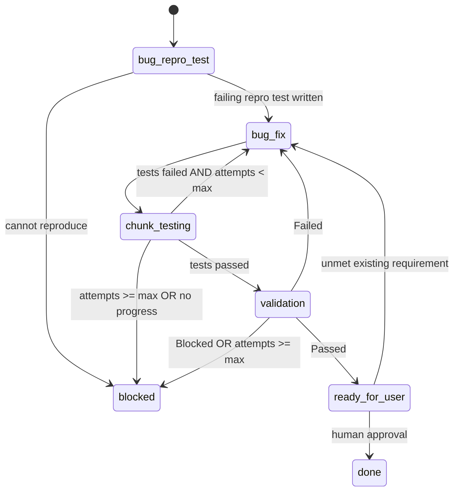

# Bug Fix Workflow

This workflow handles bug fixes.

## Flow 2: bug

Entry point is QA, not the architect.

The driver creates a single synthetic chunk in `state.json` whose `technology` matches the affected stack, so chunk-scoped artifact paths and counters behave identically to flow 1.

When the defect cannot be reproduced by an automated test, QA records the reason in `testlog.1.md` and the driver moves straight to `bug-fix` with `reproTestAvailable: false` recorded in the chunk. Validation then relies on inspection and manual evidence, and must say so.