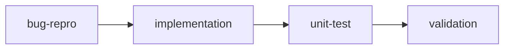

# Bug Fix Workflow

This workflow handles `bug` work items.

A bug has **no architectural specification**. The `software-architect` still authors the task plan, using `add_tasks`, and a human still approves it with `approve_plan`. Code review is not part of this flow; the reproduction test is the evidence.

## Graph

```mermaid
flowchart LR
    repro[bug-repro] --> fix[implementation]
    fix --> test[unit-test]
    test --> validation[validation]
```

## Rules

1. `bug-repro` is the first task. QA writes a test that fails for the reported defect before any fix is attempted. The failing test is the requirement source for the engineer.
2. A `bug-repro` task reaches terminal success at `tests-passing`, meaning the reproduction is in place and behaving as expected for the current state of the code. When the defect cannot be reproduced automatically, QA records `blocked` with the reason, and a human decides whether to proceed on inspection alone.
3. `implementation` fixes the defect. The engineer must not modify the reproduction test; the ownership guard rejects a run that does.
4. `unit-test` re-runs the suite. Failure returns the same task to `tests-failing` with a `failureSignature`.
5. `validation` verifies the fix against the work item's `stepsToReproduce`, `expectedResult`, and `actualResult`. There is no specification to check against.
6. `rejected` must name `remediationTargetTaskId`, normally the implementation task.
7. Review tasks are rejected by the service for this type. Do not plan one.