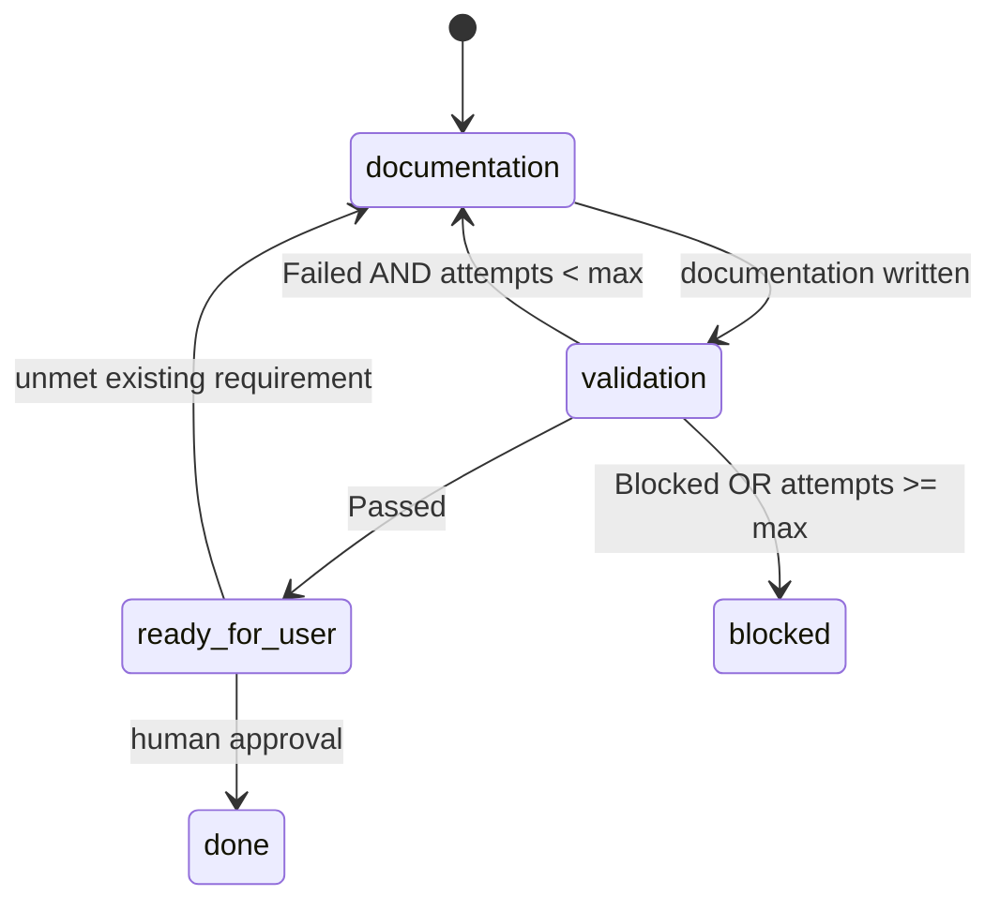

# Documentation Workflow

This workflow handles documentation work items.

## Flow 3: documentation

No specification, no automated tests, no chunks. The validator checks the documentation change against the `triage` work item.