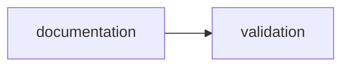

# Documentation Workflow

This workflow handles `documentation` work items.

A documentation item has **no architectural specification** and no automated tests. The `software-architect` still authors the task plan, using `add_tasks`, and a human still approves it with `approve_plan`. Code review is not part of this flow.

## Graph

```mermaid
flowchart LR
    docs[documentation] --> validation[validation]
```

Larger documentation work may be split into several `documentation` tasks feeding one `validation` task.

## Rules

1. `documentation` tasks are owned by `documentation-writer` and reach terminal success at `documented`.
2. `validation` checks the delivered documentation against the work item's `content` requirement. There is no specification to check against.
3. `rejected` must name `remediationTargetTaskId`, which returns that documentation task to `rework-required`.
4. Review tasks are rejected by the service for this type. Do not plan one.