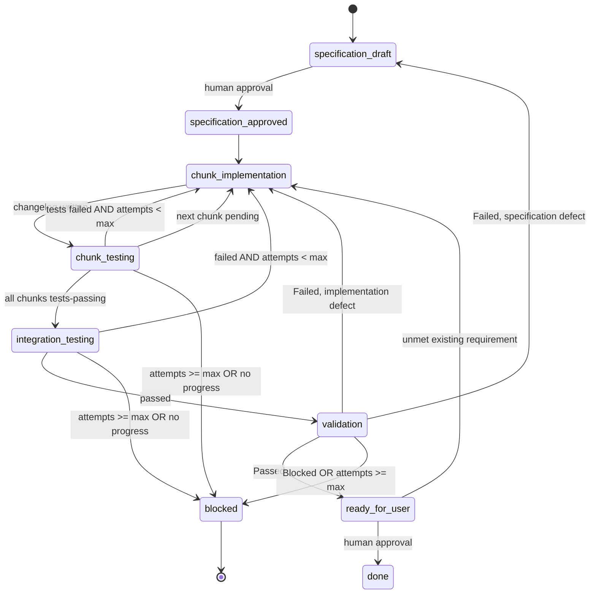

# Feature Workflow

This workflow handles user stories and chores.

## Flow 1: user story or chore

### Transition rules

1. `specification-draft` -> `specification-approved` requires a human. The driver never self-approves. `specificationStatus` in `state.json` must match the status inside `specification.md`. On this same transition, the driver bootstraps `chunks`: it must contain one entry per chunk in `specification.md`'s Chunk Breakdown, all starting at `not-started`, before any chunk is dispatched. `chunks` must never be populated lazily, one entry per completed run - the driver cannot compute dependency order or detect "no chunks remain" otherwise.
2. Chunks are processed **sequentially**, in dependency order derived from `dependsOn`. Set `activeChunk` to the first chunk whose dependencies are all `tests-passing`. Parallel execution against a shared working tree is not supported.
3. `chunk-implementation` -> `chunk-testing` on a new `changelog.{n}.md`. Increment `implementAttempts`.
4. `chunk-testing` outcome `passed` sets the chunk to `tests-passing`; the driver then selects the next pending chunk or, when none remain, moves to `integration-testing`.
5. `chunk-testing` outcome `failed` returns to `chunk-implementation` for the same chunk, subject to the failsafes below.
6. Integration failures return to `chunk-implementation` for the chunk identified as the remediation owner in the integration testlog.
7. Validation `Failed` routes to `chunk-implementation` when the defect is in the implementation, or back to `specification-draft` when the validator identifies a specification defect. The specification-defect edge is mandatory: a wrong requirement cannot be fixed by an engineer, and looping on it burns the entire budget for nothing.
8. Returning to `specification-draft` resets `specificationStatus` to `Draft` and requires fresh human approval.
9. Validation `Passed` always sets the top-level state to `ready-for-user`. The driver must not set `blocked` unless a failsafe trips or the validation artifact outcome is `Blocked`; in either case it must append an escalation.
10. At `ready-for-user`, final approval requires an explicit human instruction. The driver records the approval in `history`, sets `state` to `done`, and moves the work item from `board/in-progress/` to `board/done/`.
11. A human may request remediation at `ready-for-user` only for an unmet requirement already present in the work item or approved specification. The feedback must identify that requirement and, for flow 1, the owning chunk. The driver verifies the cited requirement exists before routing: flow 1 moves to `chunk-implementation` for the owning chunk; flow 2 moves to `bug-fix`; flow 3 moves to `documentation`. Record the feedback and cited requirement in `history`. A request for functionality outside those artifacts is out of scope: record it in `history`, retain `ready-for-user`, and do not dispatch an agent.