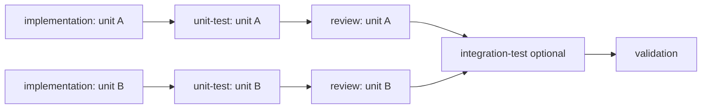

# Feature Workflow

This workflow handles `user-story` and `chore` work items. These are the only types that get an architectural specification and the only types where code review is mandatory.

## Graph

The `software-architect` authors one chain per implementation unit, then a single validation task for the work item.

```mermaid
flowchart LR
    impl_a[implementation: unit A] --> test_a[unit-test: unit A]
    test_a --> review_a[review: unit A]
    impl_b[implementation: unit B] --> test_b[unit-test: unit B]
    test_b --> review_b[review: unit B]
    review_a --> integration[integration-test optional]
    review_b --> integration
    integration --> validation[validation]
```

When no cross-unit behaviour needs proving, the architect omits the `integration-test` task and the review tasks feed `validation` directly. Nothing synthesises an integration task.

## Rules

1. The plan requires a specification. `add_spec` supplies the specification and the tasks together, and `approve_plan` gates both behind a human.
2. Every `implementation` task must have a `review` task downstream of it. The service rejects a plan that does not.
3. Tasks run in dependency order. `python -m tools.adlc next` picks the first task whose dependencies are all at terminal success. Independent chains are still executed one at a time; parallel execution against a shared working tree is not supported.
4. `unit-test` failure returns the same task to `tests-failing` and it is dispatched again. QA must supply `failureSignature` so no-progress detection works.
5. `review` returning `changes-requested` must name `remediationTargetTaskId`: the implementation task for a production defect, the test task for a test defect. The named task and everything downstream of it reset.
6. `validation` returning `rejected` must name `remediationTargetTaskId` in the same way.
7. If the validator finds the requirement itself is wrong, it returns `blocked` rather than `rejected`. A specification defect cannot be fixed by an engineer; it escalates to a human.
8. When every task reaches terminal success, `tools.adlc next` reports `ready-for-user`.
9. At `ready-for-user`, final approval requires an explicit human instruction. The orchestrator then runs `python -m tools.work_items change-status {work-item-id} done`.
10. A human may request remediation at `ready-for-user` only for a requirement already present in the work item or approved specification. Anything else is a new work item.