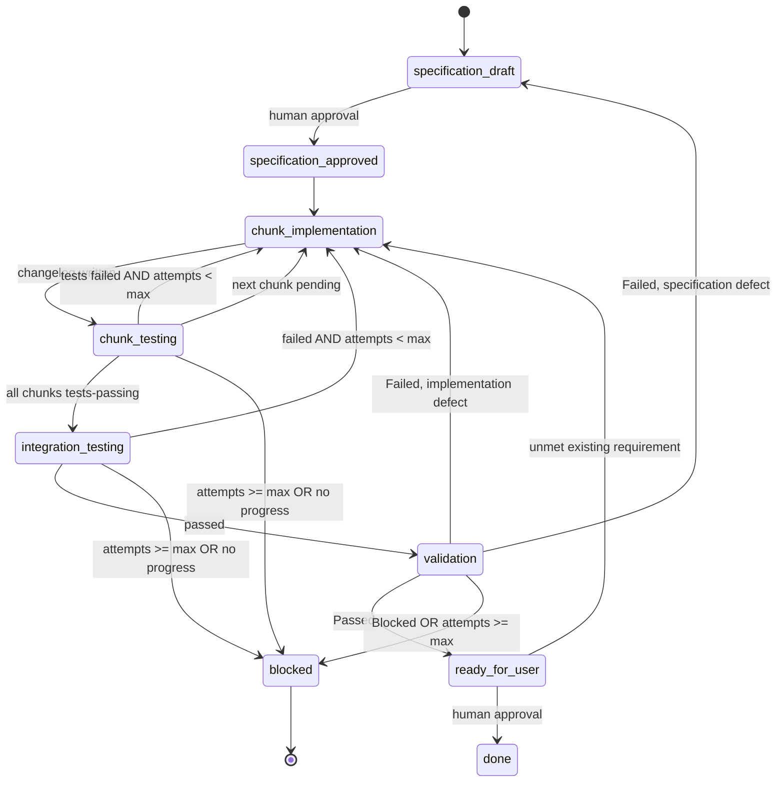
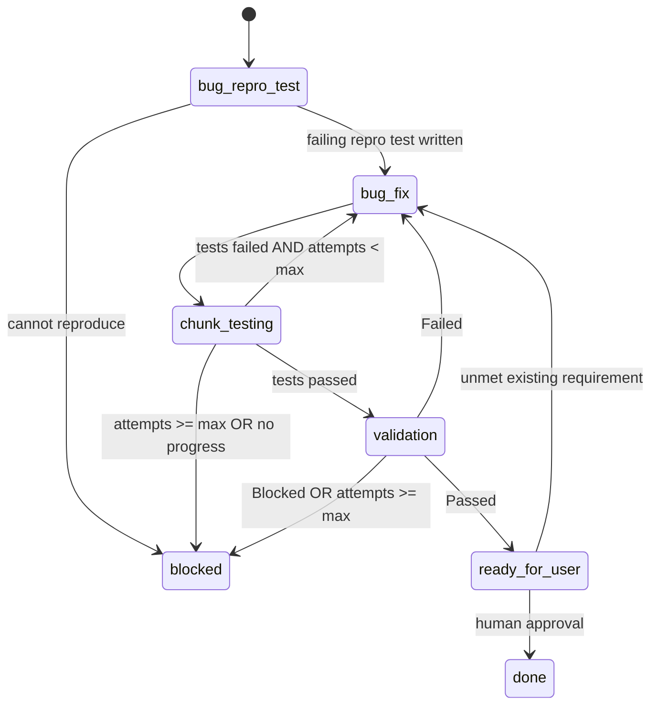
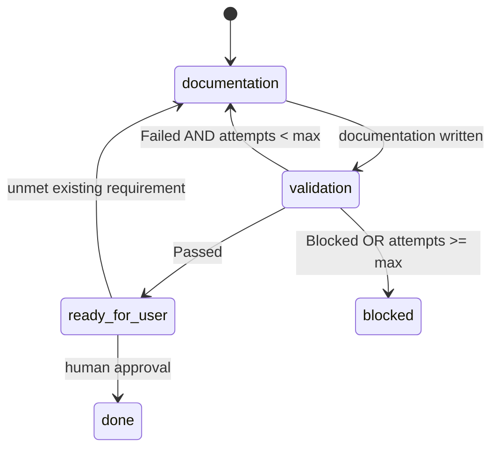

# SDLC Workflow

The `sdlc` workflow is the orchestration contract for the AI Software Factory. It defines how a work item moves from `board/new/` to a delivered, validated change.

## Core principle

Each agent session is a pure function:

> read state -> perform exactly one step -> write artifacts and append history -> stop.

Agents never decide what runs next. The **driver** (a human following this document, or the automated dispatcher) reads `handoffs/{work-item-id}/state.json`, selects the next agent, starts a **new session with a fresh context window**, and applies the resulting state transition.

This separation is what makes loop termination guaranteed rather than hoped for: an agent cannot reset its own attempt counter or route itself past a guard.

## Artifact layout

```
board/
  .id
  new/{work-item-id}.{title}.{type}.md
  in-progress/
  done/
handoffs/
  {work-item-id}/
    state.json
    specification.md
    chunks/
      {chunk-id}/
        changelog.{n}.md
        testlog.{n}.md
    integration/
      testlog.{n}.md
    validationlog.{n}.md
```

`state.json` is the single source of truth for routing. Markdown files are the payload: human-reviewable, git-diffable, and never parsed for control flow.

Iteration numbers are scoped to the chunk, not to the work item. Two chunks may both be on `changelog.2.md` without collision.

## Control file: `state.json`

```jsonc
{
  "workItemId": "00001-1",
  "type": "user-story",              // user-story | chore | bug | documentation
  "flow": "flow-1",                  // flow-1 | flow-2 | flow-3
  "state": "chunk-implementation",
  "specificationStatus": "Approved", // null | Draft | Approved
  "branch": "feature/00001-1-add-login-feature",
  "activeChunk": "dotnet-backend",
  "chunks": [
    {
      "id": "dotnet-backend",
      "technology": "dotnet",
      "dependsOn": [],
      "state": "tests-failing",
      "implementAttempts": 2,
      "testAttempts": 2,
      "lastFailureSignature": "sha256:9f2c...",
      "latestChangelog": "handoffs/00001-1/chunks/dotnet-backend/changelog.2.md",
      "latestTestlog": "handoffs/00001-1/chunks/dotnet-backend/testlog.2.md"
    }
  ],
  "integration": { "state": "not-started", "attempts": 0, "lastFailureSignature": null },
  "validation": { "outcome": null, "attempts": 0 },
  "budget": {
    "maxChunkRemediationLoops": 3,
    "maxIntegrationLoops": 3,
    "maxValidationLoops": 3,
    "maxTotalAgentRuns": 40,
    "totalAgentRuns": 17
  },
  "escalations": [],
  "history": [
    {
      "ts": "2026-09-10T09:14:00Z",
      "agent": "software-engineer",
      "chunk": "dotnet-backend",
      "result": "implemented",
      "artifact": "handoffs/00001-1/chunks/dotnet-backend/changelog.2.md"
    }
  ]
}
```

### Ownership rules

- Only the driver mutates `state.json`. That includes `state`, `chunks[].state`, attempt counters, `budget`, `escalations`, and `history`.
- Agents write their numbered artifact and report an outcome. They propose; they do not route, and they do not touch `state.json`.
- The driver applies the previous run's transition at the start of the next dispatch, by comparing `state.json` against the artifacts on disk. A missing expected artifact is a failed run under the monotonic artifact rule.
- `state.json` must be **self-sufficient**. A fresh agent needs only its work item, its specification chunk, and the artifact paths named in state. It must never depend on conversation history.

### Work item states

| State | Next agent |
| --- | --- |
| `specification-draft` | none - human approval gate; the driver records the outcome |
| `specification-approved` | `software-engineer` |
| `chunk-implementation` | `software-engineer` for `activeChunk` |
| `chunk-testing` | `quality-assurance-engineer` for `activeChunk` |
| `integration-testing` | `quality-assurance-engineer` (integration scope) |
| `validation` | `implementation-validator` |
| `bug-repro-test` | `quality-assurance-engineer` (flow 2 entry) |
| `bug-fix` | `software-engineer` |
| `documentation` | `documentation-writer` |
| `ready-for-user` | none - final human review gate; the driver records the decision |
| `done` | terminal - delivered and approved |
| `blocked` | terminal - awaiting human intervention |

### Chunk states

`not-started` -> `implemented` -> `tests-passing` | `tests-failing` -> `blocked`

## Flow 1: user story or chore



### Transition rules

1. `specification-draft` -> `specification-approved` requires a human. The driver never self-approves. `specificationStatus` in `state.json` must match the status inside `specification.md`. On this same transition, the driver bootstraps `chunks`: it must contain one entry per chunk in `specification.md`'s Chunk Breakdown, all starting at `not-started`, before any chunk is dispatched. `chunks` must never be populated lazily, one entry per completed run - the driver cannot compute dependency order or detect "no chunks remain" otherwise.
2. Chunks are processed **sequentially**, in dependency order derived from `dependsOn`. Set `activeChunk` to the first chunk whose dependencies are all `tests-passing`. Parallel execution against a shared working tree is not supported.
3. `chunk-implementation` -> `chunk-testing` on a new `changelog.{n}.md`. Increment `implementAttempts`.
4. `chunk-testing` outcome `passed` sets the chunk to `tests-passing`; the driver then selects the next pending chunk or, when none remain, moves to `integration-testing`.
5. `chunk-testing` outcome `failed` returns to `chunk-implementation` for the same chunk, subject to the failsafes below.
6. Integration failures return to `chunk-implementation` for the chunk identified as the remediation owner in the integration testlog.
7. Validation `Failed` routes to `chunk-implementation` when the defect is in the implementation, or back to `specification-draft` when the validator identifies a specification defect. The specification-defect edge is mandatory: a wrong requirement cannot be fixed by an engineer, and looping on it burns the entire budget for nothing.
8. Returning to `specification-draft` resets `specificationStatus` to `Draft` and requires fresh human approval.
9. Validation `Passed` always sets the top-level state to `ready-for-user`. The driver must not set `blocked` unless a failsafe trips or the validation artifact outcome is `Blocked`; in either case it must append an escalation.
10. At `ready-for-user`, final approval requires an explicit human instruction. The driver records the approval in `history`, sets `state` to `done`, and moves the work item from `board/in-progress/` to `board/done/`.
11. A human may request remediation at `ready-for-user` only for an unmet requirement already present in the work item or approved specification. The feedback must identify that requirement and, for flow 1, the owning chunk. The driver verifies the cited requirement exists before routing: flow 1 moves to `chunk-implementation` for the owning chunk; flow 2 moves to `bug-fix`; flow 3 moves to `documentation`. Record the feedback and cited requirement in `history`. A request for functionality outside those artifacts is out of scope: record it in `history`, retain `ready-for-user`, and do not dispatch an agent.

## Flow 2: bug

Entry point is QA, not the architect. No specification is produced.



The driver creates a single synthetic chunk in `state.json` whose `technology` matches the affected stack, so chunk-scoped artifact paths and counters behave identically to flow 1.

When the defect cannot be reproduced by an automated test, QA records the reason in `testlog.1.md` and the driver moves straight to `bug-fix` with `reproTestAvailable: false` recorded in the chunk. Validation then relies on inspection and manual evidence, and must say so.

## Flow 3: documentation



No specification, no automated tests, no chunks. The validator checks the documentation change against the `request-writer` work item.

## Failsafes

Attempt caps alone permit an agent to thrash identically three times. All of the following apply together.

1. **Per-edge attempt caps.** `maxChunkRemediationLoops`, `maxIntegrationLoops`, `maxValidationLoops`. Counters live in `state.json` and are incremented by the driver only.
2. **No-progress detection.** After each test run, compute `lastFailureSignature` as a hash of the sorted set of failing test identifiers. Two consecutive identical signatures for the same chunk escalate to `blocked` immediately, regardless of remaining budget. This is the highest-value failsafe: it catches the loop where the same mistake is repeated with cosmetic variation.
3. **Global run budget.** `maxTotalAgentRuns` is a hard circuit breaker across the entire work item. Exceeding it forces `blocked`.
4. **Monotonic artifact rule.** Every agent run must produce a new numbered artifact. A run producing none is a failed run and still counts against `totalAgentRuns`.
5. **Test-integrity guard.** Reject a `testlog` iteration in which the total test count decreased unless the testlog states an explicit justification. Prevents progress by deletion.
6. **Ownership guard.** Check the diff before accepting a run:
   - `software-engineer` must not modify test files or test projects.
   - `quality-assurance-engineer` must not modify production code.
   - `implementation-validator` must not modify any file.
   A violation invalidates the run. This prevents the classic failure where an engineer makes a test pass by editing the test.
7. **Blocked is a clean terminal state**, not a failure to retry around. On `blocked`, append an entry to `escalations` describing the requirement, the evidence, the attempts made, and the recommended human action, then stop.

## Git conventions

- One branch per work item, created by the driver before the first implementing agent runs:
  - `feature/{work-item-id}/{title}` for user stories and chores
  - `fix/{work-item-id}/{title}` for bugs
  - `docs/{work-item-id}/{title}` for documentation
- One commit per agent run, made by the **driver** after the run is accepted. Agents do not create branches or commits.
- Conventional commits style message format:
  ```
  {type}({work-item-id} [{chunk-id}]): {agent-short-name} - iteration {n}
  ```
  where `type` is "feat" for user stories, "chore" for chores, "fix" for bug fixes and "docs" for documentation. For example `feat(00001-1 [dotnet-backend]): engineer - iteration 2`. Use `-` as the chunk id for work-item-scoped runs such as validation.
- The commit trail is the execution trace, and it makes rollback to the last good state trivial when a loop goes bad.

## Artifact frontmatter

Every handoff artifact begins with this YAML block so a downstream agent can orient from the frontmatter alone and open the body only when detail is needed. Context economy matters most once a work item is many iterations deep.

```yaml
---
workItem: 00001-1
chunk: dotnet-backend        # '-' for work-item-scoped artifacts
iteration: 2
agent: software-engineer
technology: dotnet           # omit when not technology-specific
outcome: implemented         # implemented | passed | failed | blocked | Passed | Failed | Blocked
filesChanged:
  - src/Api/LoginEndpoint.cs
nextOwner: quality-assurance-engineer
---
```

## Technology specialisation

There is one `software-engineer` agent and one `quality-assurance-engineer` agent. Specialisation is a **parameter**, not a separate agent file: the driver passes the chunk's `technology` value, and the agent loads the matching rules from `.agents/rules/` and resources from `.agents/resources/`. Adding a stack means adding a rules file, not cloning an agent.

## Running the workflow

### Stage 1: driver-assisted (current)

Use the `.agents/prompts/next.prompt.md` dispatcher. Given a work item id, it reads `state.json`, reports the next agent and the exact opening instruction, and states the transition to apply afterwards. Run each step in a new chat session to guarantee a fresh context window.

Human gates remain at `specification-draft -> specification-approved` and at `ready-for-user -> done`. Final-review remediation is limited to unmet requirements already recorded in the work item or approved specification; scope additions become separate work items.

### Stage 2: automated (planned)

Once the state machine is stable, a driver under `tools/factory/` reads `state.json`, invokes the CLI non-interactively with the selected agent, applies the transition, and commits. Each invocation is a separate process, so fresh context comes for free. The transition logic must be unit tested, because it is the actual guarantee that loops terminate.
