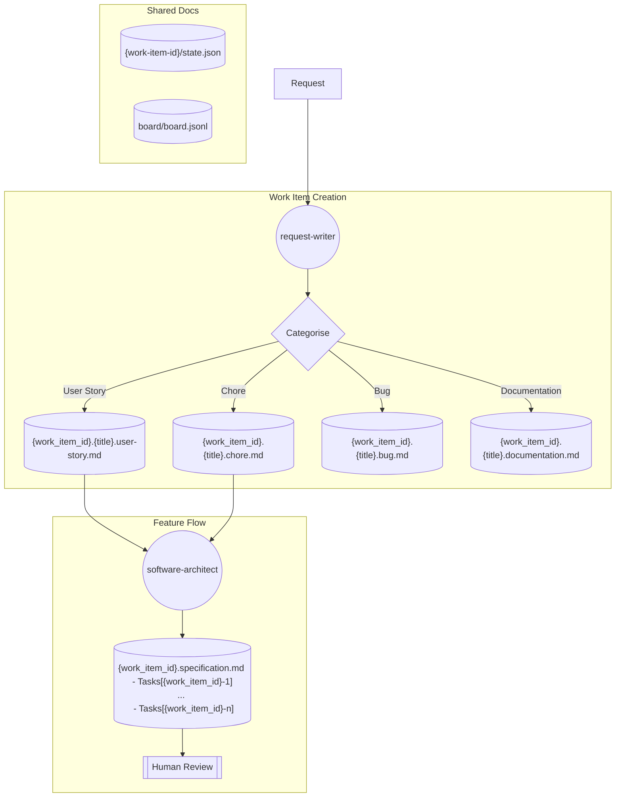
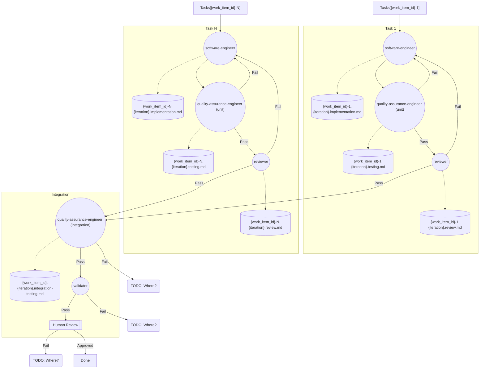

## General

- Use `.jsonl` format for large JSON arrays.  It is one JSON object per line and ditches the [] and comma separators of arrays.  It is more efficient for machines to read.

## Workbenches

In short, at start:

- Initialise state
- Run init script and create report (move this to a skill so you only need to it once per system or when something changes?)
- Generate spec/task frames (work items)

Then for each work item:

- Read init report
- Read scope contract
- Read state
- Edit allowed files only.
- Run acceptance command via feedback runner
- Run verification gate
- Run reviewer
- Generate handoff

### Workbench Surfaces

|Surface     |What it carries                                     |Failure when missing                |Implementation|
|----|----|----|----|
|Instructions|Startup rules, forbidden actions, definition of done|Agent guesses what shipping means   |AGENTS.md + rules|
|State       |Current task, touched files, blockers, next action  |Each session restarts from zero     |File e.g. state.json, DB or whatever|
|Scope       |Allowed files, forbidden files, acceptance criteria |Edits leak into unrelated code      |Allowed/forbidden globs in spec|
|Feedback    |Real command output captured into the loop          |Agent declares success on a 400     |Handoff doc/record|
|Verification|Tests, lint, smoke run, scope check                 |"Looks good" reaches main           |Function tiggered on task close|
|Review      |A second pass with a different role                 |Builder marks own homework          |Separate readonly worker|
|Handoff     |What changed, why, what is left                     |Next session re-discovers everything|Durable record at session end|

### Task Frame

|Field	|Question|
|----|----|
|Goal               |What observable behavior must change?|
|Repository facts   |What did you verify in code, tests, config, or history?|
|Allowed paths      |Where may the change land?|
|Forbidden paths    |What must remain untouched?|
|Acceptance evidence|Which commands or observations prove the goal?|
|Unknowns           |Which decisions still need evidence or human judgment?|

### Work Item Plan

|Commitment  |Purpose|
|----|----|
|Identifier  |Stable reference for dependencies and handoff|
|Change      |The smallest behavior or contract change|
|Evidence    |Repository facts that justify the change|
|Dependencies|Work that must be true first|
|Proof       |The exact check that closes the item|

### Minimal implementation

Three files. A tiny root file that routes the agent into deeper files only when relevant. Durable state the agent reads before acting and writes after. A task board that says what is in flight, what is blocked, and what is up next.

`AGENTS.md` is a router, not a manual.
A good AGENTS.md is short. It points the agent at:

- The state file (where you are).
- The task board (what is left).
- The deeper rules (under docs/agent-rules.md).
- The verification command (how to know it works).

`agent_state.json` is the system of record.
State carries: the active task id, the touched files, the assumptions made, the blockers, and the next action. The agent reads it at every turn. The next session reads it instead of replaying chat.
State lives in a file because chat history is unreliable. Sessions die. Conversations get trimmed. The file does not.

`task_board.json` is the queue.
The task board carries every task with status `todo | in_progress | done | blocked`. It is the queue the agent pulls from when state is empty, and the queue you read when you want to know whether the agent is on track.
A task on the board has an id, a goal, an owner (`builder`, `reviewer`, or `human`), and acceptance criteria. The board is small on purpose: when it grows past a screen, you have a planning problem, not a board problem.

### Rules

Rules belong in `docs/agent-rules.md`, away from the short root router. Each rule has a name, a category, and a check.

|Category          |Question the rule answers	         |Example|
|----|----|----|
|Startup           |What must be true before work begins?|"state file exists and is fresh"|
|Forbidden         |What must never happen?              |"do not edit scripts/release.sh"|
|Definition of done|What proves the task is complete?    |"pytest exits 0 and acceptance line passes"|
|Uncertainty       |What does the agent do when unsure?  |"open a question note instead of guessing"|
|Approval          |What requires human approval?        |"any new dependency, any prod write"|

Each rule has a slug, a category, a one-line description, and a check field that names a function in rule_checker.py. Adding a rule means adding a check; the checker grows with the workbench.

|Tier      |Lives in	       |Read when	                         |Size budget|
|----|----|----|----|
|Router    |AGENTS.md	       |Every session, always                |Under ~50 lines|
|Rules     |docs/agent-rules.md|Every session, on startup            |One screen per category|
|Topic docs|docs/<topic>.md    |Only when the task touches that topic|As deep as needed|

### Repo Memory

Agent state. Persist in JSON. Use a schema and validate it on load.
When the schema changes, ship a migration script next to the schema bump. The state file carries a `schema_version` field; the manager refuses to load a file from a version it cannot migrate.

|Belongs	               |Does not belong|
|----|----|
|Active task id            |Raw chat transcripts|
|Touched files this session|Token-level reasoning traces|
|Assumptions the agent made|"The user seemed frustrated"|
|Open blockers             |Sampled completions|
|Next action               |Vendor-specific model ids|

### Initialisation

Do setup work once so agents don't have to repeat it.
Get the .NET SDK, guess the test command, determine the entry point etc.
Do it once and write `init_report.json` that subsequent agents can ingest.

|Probe                  |Why it matters|
|----|----|
|Runtime versions       |Wrong Python or Node version means silent wrong-version bugs|
|Dependency availability|A missing package later costs ten times the cost of catching it now|
|Test command           |The agent must know how to verify; if the command is missing the workbench is broken|
|Repo paths             |Hard-coded paths drift; resolve them once and pin|
|Environment variables  |Missing OPENAI_API_KEY is a failure surface, not a runtime mystery|
|State + board freshness|Stale state from a crashed session is a footgun|
|Last-known-good commit |Anchor for the handoff diff at the end of the session|

A probe failure means halt and surface to the human. The whole point of init is to refuse to start when the workbench is broken.
Run it twice in a row. The second run should be a no-op except for a fresh timestamp. Idempotency is what lets you wire the script into CI, hooks, or a pre-task slash command.

### Scope Contract

The scope contract bounds one task. 

|Field	            |Purpose|
|----|----|
|task_id            |Links to the task on the board|
|goal               |One sentence the reviewer can verify|
|allowed_files      |Globs the agent may write|
|forbidden_files    |Globs the agent must not touch even by accident|
|acceptance_criteria|Test commands or assertion lines that prove done|
|rollback_plan      |One paragraph the operator can execute if a halt is required|
|approvals_required |Actions outside scope that need explicit human sign-off|

Pin contracts to globs (`app/*/.py`, `tests/test_signup*.py`) so a refactor between sessions does not invalidate the contract.
Listing how to roll back forces the contract author to think about what could go wrong. A contract you cannot roll back from is a contract that should not be approved.
The agent writes a diff. The checker reads the diff, the allowed globs, the forbidden globs, and a list of any acceptance commands that ran. Each violation is a tagged finding the verification gate can refuse.

`feature_list.json` is a higher level spec the agent reads at session start. It is the project backlog as a machine-readable, ordered file.
The agent picks exactly one feature whose status is `todo`, writes its id into the active scope contract, and is forbidden from starting a second feature in the same session.

|Field	             |Purpose|
|----|----|
|active              |The single feature the current session may touch; empty means pick one and set it|
|features[].id       |Stable slug the scope contract's task_id points at|
|features[].status   |todo, in_progress, done, blocked; only one in_progress at a time|
|features[].goal     |One sentence the reviewer can verify|
|features[].done_when|The acceptance line that flips in_progress to done|

### Feedback Record

| Field | Why it matters |
|----|----|
|command    |Exact argv, no shell expansion surprises|
|stdout_tail|Last N lines, deterministic truncation|
|stderr_tail|Last N lines, separate from stdout|
|exit_code  |The unambiguous success signal|
|duration_ms|Surfaces slow probes and runaway processes|
|started_at |Timestamp for replay|
|agent_note |One line the agent writes about what it expected|

### Verification Gates

The gate must produce the same verdict for the same artifact set every time. No LLM judges.
Block-severity findings cannot be overridden by the agent. They can only be overridden by a human, with a recorded `override_reason` and an `overridden_by` user id. 

|Check	                                |Source artifact	  |Severity|
|----|----|----|
|All acceptance commands ran            |feedback_record.jsonl|block|
|All acceptance commands exited zero    |feedback_record.jsonl|block|
|Scope check has no forbidden writes    |scope_report.json    |block|
|Scope check has no off-scope writes    |scope_report.json    |block or warn|
|All block-severity rules pass          |rule_report.json     |block|
|No null exit codes in feedback         |feedback_record.jsonl|block|
|Touched files match scope.allowed_files|both                 |warn|

### Reviewer Agent

Reviews a diff.
Produces `review_report.json`. It scores each of 5 categories 0 to 2. Max Total 10. Score < 7 is soft fail; below 5 a hard fail.
Readonly, cannot edit the diff.

|Dimension	         |Question|
|----|----|
|Problem fit         |Did the change solve the task as stated, not a nearby task?|
|Scope discipline    |Were edits confined to the contract or was the contract grown deliberately?|
|Assumptions         |Are all hidden assumptions written down somewhere reviewable?|
|Verification quality|Does the acceptance command actually prove the goal, or did it prove a weaker version?|
|Handoff readiness   |Could the next session pick up cleanly from the current state?|

### Delegate agent work

Each delegated unit needs:

|Field	     |Meaning|
|----|----|
|Goal	     |One observable result|
|Owner	     |One accountable worker|
|Paths	     |Exclusive write ownership|
|Dependencies|Completed units required before starting|
|Proof       |Exact evidence returned to the integrator|
|Handoff     |Files changed, decisions made, remaining risk|

“Handle the backend” is not a work unit. “Implement the duplicate check in app/accounts.py and prove it with the focused account test” is.

Work units should only be done in parallel if the files affected are entirely separate and the work is atomic, including subsequent review and testing.

Parallel work items then need to pass through an integrator for review:

- confirm each handoff matches its assigned scope;
- read the proof output, not just the worker’s summary;
- combine changes in dependency order;
- run the full cross-unit gate;
- reject hidden scope expansion;
- record conflicts as new decisions, not silent edits.

### Multi session handoff

|Field	        |Question it answers|
|----|----|
|summary        |One paragraph of what was done|
|changed_files  |The diff at a glance|
|commands_run   |What was actually executed|
|failed_attempts|What was tried and why it did not work|
|open_risks     |What could bite next session, with severity|
|next_action    |The first concrete step next session takes|
|verdict_pointer|Path to the verification + review reports|

The `next_action` field is the load-bearing one. A handoff with everything except `next_action` is a status report, not a handoff.

The generator reads the workbench artifacts and emits the packet. The agent's job is to leave the workbench in a state the generator can summarize, not to write the summary.

Two forms: `handoff.md` is what the human reads. `handoff.json` is what the next agent loads. Both come from the same source artifacts. If they diverge, the JSON wins.

- board/
  - .id
  - board.jsonl
  - 00001/
    - 00001-1.work-item.md [triage]
    - 00001-2.work-item.md [triage]
    - 00001-1/
      - 00001-1.state.json [orchestrator]
      - 00001-1.specification.md [architect]
      - task-1/
        - 00001-1.task-1.implementation.1.md [engineer]
        - 00001-1.task-1.testing.1.md [qa]
        - 00001-1.task-1.review.1.md [reviewer]
      - task-2/
        - 00001-1.task-2.implementation.1.md [engineer]
        - 00001-1.task-2.testing.1.md [qa]
        - 00001-1.task-2.review.1.md [reviewer]
      - 00001-1.integration.1.md [qa]
      - 00001-1.validation.1.md [validator]
    - 00001-2/
      - 00001-2.state.json [orchestrator]
      - 00001-2.specification.md [architect]
      - task-1/
        - 00001-2.task-1.implementation.1.md [engineer]
        - 00001-2.task-1.testing.1.md [qa]
        - 00001-2.task-1.review.1.md [reviewer]
      - task-2/
        - 00001-2.task-2.implementation.1.md [engineer]
        - 00001-2.task-2.testing.1.md [qa]
        - 00001-2.task-2.review.1.md [reviewer]
      - 00001-2.integration.1.md [qa]
      - 00001-2.validation.1.md [validator]

## TODO
- Fold chunks into user stories (perhaps add category [feature | chore])
